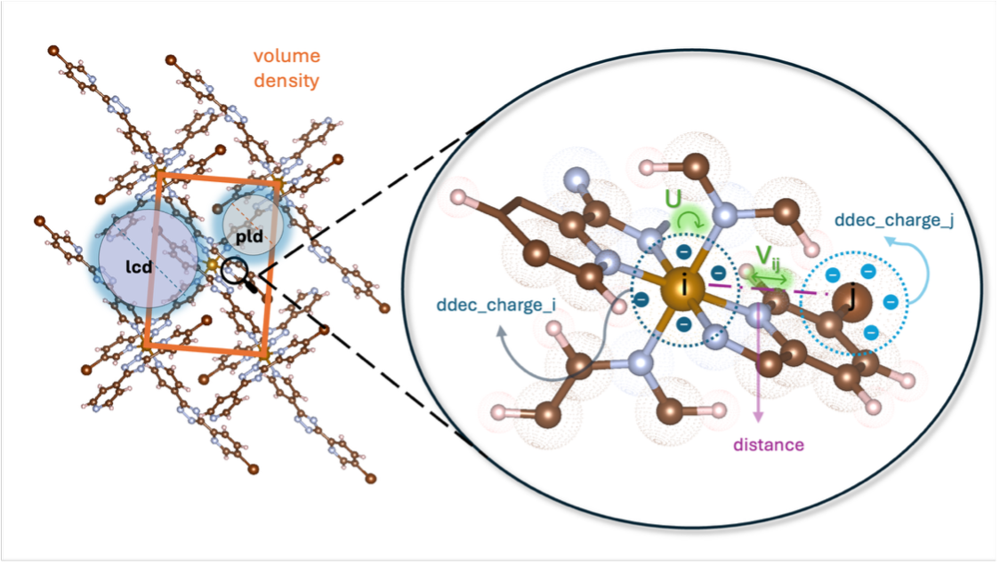

# Predicting Hubbard Parameters in MOFs

This project predicts Hubbard `U` and `V` parameters from crystal-structure data to reduce the need for expensive first-principles calculations.

This repository is the final capstone project for the MBA in Data Science and Analytics at ESALQ/USP, based on the thesis titled *Linear and non-linear relationships in the prediction of Hubbard parameters in metal-organic frameworks*.

**Production follow-up:** models from this analysis are served in [tbhubbard-production](https://github.com/pcostacarvalho/tbhubbard-production) (FastAPI, Streamlit, Docker, CI, live demo).

## Problem
The goal is to estimate two electronic interaction parameters (`U` and `V`) for metal-organic frameworks (MOFs) using machine learning. Computing these parameters directly is costly, so faster predictive models can support large-scale material screening. The project uses the TBHubbard/QMOF data pipeline with structural, chemical-identity, charge, and distance descriptors.

## Methods
- Exploratory data analysis (target distributions, missing values, Pearson correlation, scatter plots)
- Data cleaning and preprocessing (label fixes, NaN handling, group-aware train/test split by `qmof_id`)
- Outlier filtering with IQR (by chemical group), plus `V >= 0.01 eV` filtering for inter-site interactions
- Multicollinearity check with VIF and removal of `lcd` (high VIF)
- Multiple linear regression with stepwise selection for `U` and `V`
- Random Forest regression for `V` with grid search cross-validation
- Evaluation with `R²`, `RMSE`, and `MAE` on train and test sets

## Results
| Model (test set) | R² | RMSE (eV) | MAE (eV) |
|---|---:|---:|---:|
| Linear Regression (U) | 0.970 | 0.304 | 0.181 |
| Linear Regression (V) | 0.167 | 0.099 | 0.047 |
| Random Forest (V) | 0.782 | 0.050 | 0.026 |

Best model for `U`: **Linear Regression**, with `R² = 0.970` and `MAE = 0.181 eV`.  
Best model for `V`: **Random Forest**, with `R² = 0.782` and `MAE = 0.026 eV`.

## Dataset
TBHubbard (linked with QMOF) — [Harvard Dataverse](https://dataverse.harvard.edu/dataset.xhtml?persistentId=doi:10.7910/DVN/ZKLRLF)  
~464,509 pair-level observations derived from 242 MOFs. **Provenance:** global structural descriptors (`pld`, `lcd`, `density`, `volume`) come from **QMOF**; Hubbard targets (`U`, `V`), distances, site identities, and local charge columns come from **TBHubbard**. See `data/README.md` for citations and details.

## Variables Used


The figure summarizes the modeling descriptors used in this project:
- **Global structural descriptors (QMOF):** `pld`, `lcd`, `volume`, `density`
- **From TBHubbard:** on-site `U`, inter-site `V`, `distance`, `atom_i`, `atom_j`, `ddec_charge_i`, `ddec_charge_j`

## Notebooks

The main analysis lives under `notebooks/`. Run them in order **01 → 02 → 03 → 04** so each stage reads outputs from the previous one. **`05_extra.ipynb`** is optional and uses processed data from **02** (and can be run independently of **03**/**04**).

| Notebook | Description |
| --- | --- |
| **`01_data_exploration.ipynb`** | Explores `tbhubbard_database.csv`: defines on-site **U** vs inter-site **V**, checks data quality, and plots distributions, Pearson correlations, and scatter diagnostics to motivate preprocessing and model choices. |
| **`02_preprocessing.ipynb`** | Builds model-ready **U** and **V** tables: group-aware train/test split by `qmof_id`, IQR-based outlier handling, `V` filtering, multicollinearity (VIF), and exports cleaned train/test CSVs under `data/processed/`. |
| **`03_modeling.ipynb`** | Fits stepwise linear regression for **U** and **V**, Random Forest for **V** with grid search, and writes predictions, linear coefficients, RF feature importances, and optional metrics to `data/processed/` for evaluation. |
| **`04_results_evaluation.ipynb`** | Loads artifacts from **03** (predictions, coefficient CSVs, RF importances) and reproduces thesis-style diagnostic panels: parity plots, residuals, boxplots by element, and coefficient or importance side panels. |
| **`05_extra.ipynb`** | Optional **global** model on merged **U**+**V** rows with a single Random Forest (see notebook for feature construction and leakage safeguards). Writes e.g. `predictions_uv_rf.csv` and `rf_uv_feature_importance.csv` when executed. |

Shared code used by some notebooks is in **`notebooks/aux_functions.py`**. Older exploratory copies at the repository root (`linear_correct.ipynb`, `tree_correct.ipynb`, and similar) are informal drafts and are not required to reproduce the numbered pipeline.

## Data layout

- **`data/tbhubbard_database.csv`** — Single merged table (QMOF structural descriptors + TBHubbard targets and site-level fields) used from exploration through preprocessing.
- **`data/README.md`** — How QMOF and TBHubbard fields are combined, full references, and suggested BibTeX entries.
- **`data/processed/`** — Generated by the notebooks (do not edit by hand). Typical files after running the pipeline:
  - **`clean_data_train_u.csv`**, **`clean_data_test_u.csv`**, **`clean_data_train_v.csv`**, **`clean_data_test_v.csv`** — Train/test splits from **02**.
  - **`predictions_u_linear.csv`**, **`predictions_v_linear.csv`**, **`predictions_v_rf.csv`** — Test-set predictions from **03**.
  - **`linear_u_coefficients.csv`**, **`linear_v_coefficients.csv`** — Stepwise OLS coefficients from **03** (used in **04**).
  - **`rf_v_feature_importance.csv`** — Random Forest **V** importances from **03**.
  - **`model_metrics.csv`** — Optional compact metrics table if your **03** run exports it.
  - From **`05_extra`** (if run): e.g. **`predictions_uv_rf.csv`**, **`rf_uv_feature_importance.csv`**.

Place `tbhubbard_database.csv` in `data/` before running **01** (see **Dataset** and `data/README.md` for download and citation).

## How to reproduce

```bash
conda env create -f environment.yml
conda activate tbhubbard-ml
jupyter notebook notebooks/
```

Recommended execution order: **01** → **02** → **03** → **04**; then **05** if you want the merged U+V experiment.

## Stack
Python | pandas | numpy | scikit-learn | statsmodels | matplotlib | seaborn | jupyter
